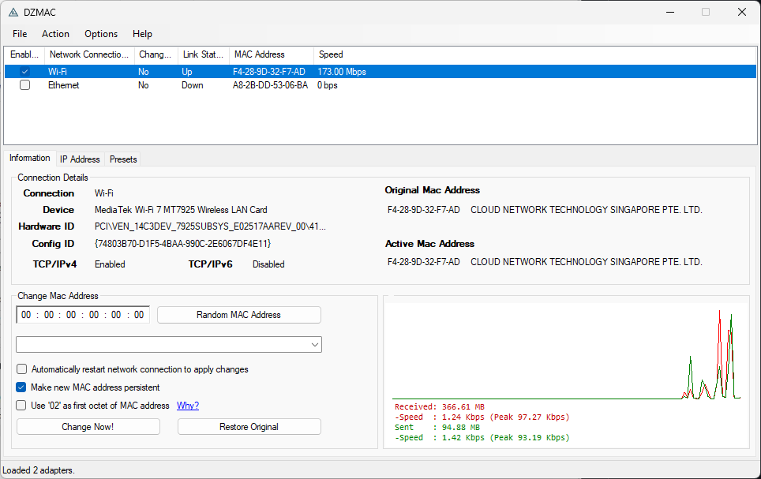
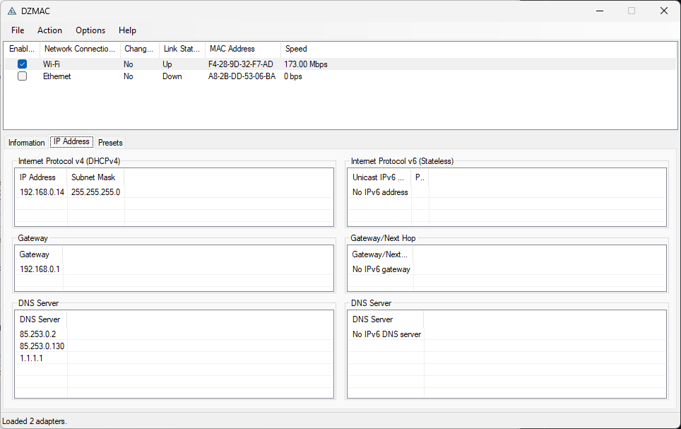
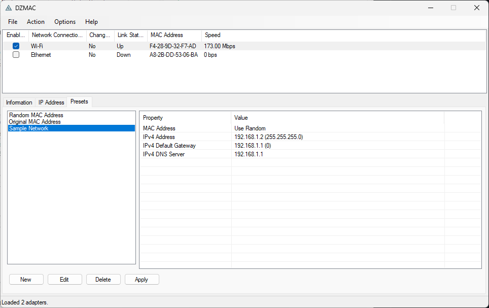

# DZMAC

## Overview

DZMAC is a Windows desktop application for viewing network adapters and managing MAC address–related settings with a deliberately constrained scope. It is a reimplementation of [Technitium MAC Address Changer aka TMAC](https://technitium.com/tmac/), not a reverse-engineering product, but does **not** aim for feature parity.

The goal is to provide a focused, predictable, and maintainable application centered on core adapter management workflows.

## Status

This project is in **alpha** stage.

The focus is on stabilizing core functionality before expanding scope for DZMAC. [Technitium MAC Address Changer aka TMAC](https://technitium.com/tmac/) has been around over a decade and it has been used by hundreds of thousands of people, if not millions. DZMAC is a reimplementation from scratch, trying to be as faithful as possible to the original. However, there are some design decisions made explicitly excluding some fetures.

## Usage

### Adapter-type definitions
- **Physical adapter**: an adapter reported as hardware-backed by Windows adapter metadata (preferred: `MSFT_NetAdapter`; fallback: `Win32_NetworkAdapter.PhysicalAdapter`).
- **Virtual/logical adapter**: an adapter reported as virtual/filter/endpoint/logical by Windows metadata, or one with `PhysicalAdapter = false` on older WMI paths.
- **Fallback classification**: if explicit adapter-type properties are unavailable, DZMAC falls back to `PNPDeviceID` prefix inference (`PCI\\`, `USB\\`, `ACPI\\`) as best effort only.

### Showing physical vs virtual adapters
- By default, DZMAC focuses on likely physical adapters for a cleaner day-to-day list.
- Use **Options → Show All Adapters** to include virtual/logical adapters in the grid.
- **File → Export Text Report** exports exactly what is currently visible in the adapter list.

See [wiki](https://github.com/zbalkan/DZMAC/wiki/Help) for help.

## How DZMAC differs from TMAC

DZMAC started as a reimplementation of TMAC, but it intentionally makes different
product and UX choices. The list below highlights the most important current
differences so expectations are clear.

### Physical adapters first (virtual adapters optional)

By default, DZMAC focuses the adapter list on likely physical adapters for a
cleaner day-to-day experience. Virtual/logical adapters can still be shown
through **Options → Show All Adapters**.

This also affects **File → Export Text Report**: the export contains exactly
what is currently shown in the adapter list. To export all adapters (including
virtual/logical), enable **Options → Show All Adapters** first.

### Presets and `.tpf` workflow

- On first launch, DZMAC creates a default `default.tpf` file in the application directory when one does not exist.
- You can manage presets in the **Presets** tab and apply the selected preset to the currently selected adapter.
- Use **File → Open Preset** to load a preset file, **Save Preset** / **Save Preset As** to persist edits, and **Import Preset** / **Export Preset** for selective transfer between files.
- Launching `DZMAC.exe <path-to-file>.tpf` opens that preset file directly in the GUI.
- Note that, DZMAC can read TMAC `.tpf` files, but **it is not backwards compatible**. Therefore, you cannot make updated `.tpf` files to work with TMAC.

### Adapter enable/disable is menu-driven

The **Enabled** checkbox in the adapter list is intentionally read-only and
serves as a status indicator only.

Adapter state changes are performed exclusively through
**Action → Enable Adapter** / **Action → Disable Adapter** so the flow can
consistently enforce confirmation dialogs, status-bar feedback, and diagnostics.

### Event logs

The Windows event logs are used for diagnosing issues, and can be found under **Event Logs > Applications > DZMAC**. For a clearer understanding, visit [Event Log Catalog](https://github.com/zbalkan/dzmac/wiki/Event-Log-Catalog) page.

### Narrower feature scope, fewer bundled utilities

The following decisions define the current user-facing scope:

#### No DHCPv6

Only DHCPv4 is supported. DHCPv6 is intentionally out of scope.

#### No proxy management

Internet Explorer / system proxy configuration is not supported.

#### No auto-updater

The application does not include update infrastructure.

#### No system tray

The application is not a background utility:
- no system tray icon
- no tray animation

#### Preset files (`.tpf`) are supported

DZMAC now includes preset management compatible with `.tpf` files:
- dedicated **Presets** tab with create/edit/delete/apply actions
- **File** menu support for open/save/save-as/import/export preset workflows
- startup support for opening a `.tpf` file directly (including via file association)
- optional current-user `.tpf` association through **File → Associate with Preset Files (.tpf)**

The serializer focuses on the supported subset (MAC mode + IPv4 fields) and keeps parsing resilient when unsupported residual bytes are encountered.

#### Reduced "all-in-one" behavior

Unlike TMAC's broader utility surface, DZMAC keeps optional/auxiliary behavior to a minimum and emphasizes explicit, focused actions in the main UI.

### DHCP disable behavior is safe-by-default

Disabling DHCPv4 preserves the current configuration instead of discarding it.

## Acknowledgements

First and foremost, I'd like to thank [Shreyas Zare](https://github.com/ShreyasZare) for [Technitium MAC Address Changer](https://technitium.com/tmac/) and other amazing contributins for the community.

Also, thanks to the following projects and resources:

- [MACAddressTool](https://github.com/sietseringers/MACAddressTool) for internals and implementation ideas.
- The [objectlistview](https://objectlistview.sourceforge.net/cs/index.html) project for list-view handling.
- [MAC-Address-Text-Box-and-Class article on CodeProject](https://web.archive.org/web/20161025183601/http://www.codeproject.com/Articles/15117/MAC-Address-Text-Box-and-Class) for MAC address textbox implementation reference.

## License

This project is licensed under MIT License.

Te ObjectListView component is licensed under GPL3. The changes including migrating from .NET 2.0 to 4.8.1 can be fund under project directory.