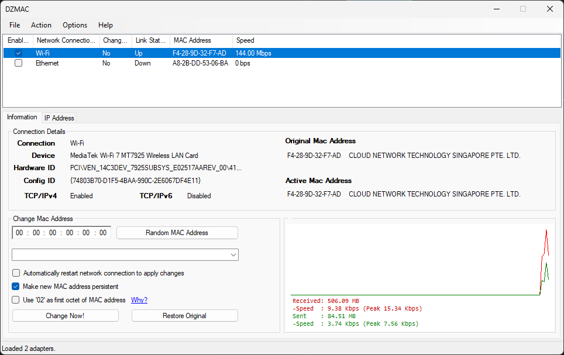

# DZMAC

## Overview

DZMAC is a Windows desktop application for viewing network adapters and managing MAC address–related settings with a deliberately constrained scope. It is a reimplementation of [Technitium MAC Address Changer aka TMAC](https://technitium.com/tmac/), not a reverse-engineering product, but does **not** aim for feature parity.

The goal is to provide a focused, predictable, and maintainable application centered on core adapter management workflows.

## Status

This project is in **alpha**.

The focus is on stabilizing core functionality before expanding scope for DZMAC.

## Help

See [wiki](https://github.com/zbalkan/DZMAC/wiki/Help) for help.

## How DZMAC differs from TMAC

DZMAC started as a reimplementation of TMAC, but it intentionally makes different
product and UX choices. The list below highlights the most important current
differences so expectations are clear.

### Physical adapters first (virtual adapters optional)
By default, DZMAC focuses the adapter list on likely physical adapters for a
cleaner day-to-day experience. Virtual/logical adapters can still be shown
through **Options → Show All Adapters**.

This also affects **File → Export Text Report**: the export contains exactly
what is currently shown in the adapter list. To export all adapters (including
virtual/logical), enable **Options → Show All Adapters** first.

### Adapter enable/disable is menu-driven
The **Enabled** checkbox in the adapter list is intentionally read-only and
serves as a status indicator only.

Adapter state changes are performed exclusively through
**Action → Enable Adapter** / **Action → Disable Adapter** so the flow can
consistently enforce confirmation dialogs, status-bar feedback, and diagnostics.

### Narrower feature scope, fewer bundled utilities
The following decisions define the current user-facing scope:

#### No DHCPv6
Only DHCPv4 is supported. DHCPv6 is intentionally out of scope.

#### No proxy management
Internet Explorer / system proxy configuration is not supported.

#### No auto-updater
The application does not include update infrastructure.

#### No system tray
The application is not a background utility:
- no system tray icon
- no tray animation

#### Preset file support is postponed
Preset files (`.tpf`) are planned but not part of the current milestone.  
As a result:
- no startup file association checks
- no preset import/export in current scope

#### Reduced "all-in-one" behavior
Unlike TMAC's broader utility surface, DZMAC keeps optional/auxiliary behavior
to a minimum and emphasizes explicit, focused actions in the main UI.

### DHCP disable behavior is safe-by-default
Disabling DHCPv4 preserves the current configuration instead of discarding it.

## Acknowledgements

Thanks to the following projects and resources:

- [Technitium MAC Address Changer](https://technitium.com/tmac/) for everything!
- [MACAddressTool](https://github.com/sietseringers/MACAddressTool) for internals and implementation ideas.
- The [objectlistview](https://objectlistview.sourceforge.net/cs/index.html) project for list-view handling.
- [MAC-Address-Text-Box-and-Class article on CodeProject](https://web.archive.org/web/20161025183601/http://www.codeproject.com/Articles/15117/MAC-Address-Text-Box-and-Class) for MAC address textbox implementation reference.
