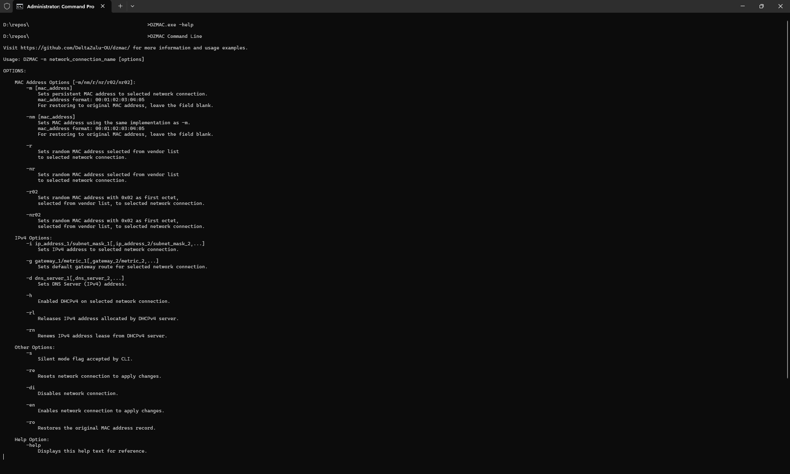

# DZMAC

[](https://github.com/DeltaZulu-OU/dzmac/actions/workflows/pr-tests.yml)
[](https://github.com/DeltaZulu-OU/dzmac/actions/workflows/dependabot/dependabot-updates)
[](https://github.com/DeltaZulu-OU/dzmac/actions/workflows/github-code-scanning/codeql)

## Overview

DZMAC is a Windows desktop application to spoof MAC address. It is a reimplementation of [Technitium MAC Address Changer (TMAC)](https://technitium.com/tmac/), not a reverse-engineering product, but does **not** aim for feature parity.

The goal is to provide a focused, predictable, and maintainable application centered on core adapter management workflows.

## Status

This project is in **alpha** stage.

DZMAC is a from-scratch reimplementation of [TMAC](https://technitium.com/tmac/). The current focus is stabilizing the core adapter-management workflow before expanding the feature set.

TMAC has existed for more than a decade and has been widely used. DZMAC tries to preserve the familiar core experience where it makes sense, but it deliberately does not aim for full feature parity. Some TMAC features are excluded or redesigned to keep DZMAC smaller, clearer, and easier to maintain.

## Usage

DZMAC shows likely physical network adapters by default. This keeps the main adapter list focused on the devices most users want to manage day to day.

Use **Options → Show All Adapters** to include virtual, logical, VPN, hypervisor, filter, and other software-defined adapters.

**File → Export Text Report** exports exactly what is currently visible in the adapter list. To export all adapters, enable **Show All Adapters** first.

Presets are managed from the **Presets** tab. DZMAC supports `.tpf` preset files for the currently supported preset fields. You can open, save, save as, import, and export presets from the **File** menu. Launching DZMAC with a `.tpf` path opens that preset file directly:

```powershell
DZMAC.exe <path-to-file>.tpf
```

DZMAC can read supported data from TMAC .tpf files, but updated files are not guaranteed to remain compatible with TMAC.

See the [wiki](https://github.com/zbalkan/DZMAC/wiki/Help) for help.




## How DZMAC differs from TMAC

DZMAC is inspired by TMAC, but it makes different product and UX decisions. The main differences are listed below.

### Physical adapters first

DZMAC uses Windows adapter metadata to decide whether an adapter is physical or virtual/logical.

The preferred source is `MSFT_NetAdapter`. On older paths, DZMAC falls back to `Win32_NetworkAdapter.PhysicalAdapter`. If explicit adapter-type metadata is unavailable, DZMAC uses `PNPDeviceID` prefix inference such as `PCI\\`, `USB\\`, and `ACPI\\` as a best-effort fallback.

This classification is intentionally conservative. Some real hardware may still appear as non-physical depending on driver metadata. Use **Options → Show All Adapters** when you need the full adapter list.

### Adapter state changes are menu-driven

The Enabled checkbox in the adapter list is read-only. It is a status indicator, not an action control.

Adapter state changes are performed through **Action → Enable Adapter** and **Action → Disable Adapter**. This keeps confirmation dialogs, status-bar feedback, diagnostics, and error handling in one consistent workflow.

### Preset support is limited to the supported DZMAC model

DZMAC supports `.tpf` preset workflows, including:

- creating a default `default.tpf` file on first launch when one does not exist
- creating, editing, deleting, and applying presets from the Presets tab
- opening, saving, importing, and exporting preset files from the File menu
- opening a preset file directly at startup
- optional current-user `.tpf` file association through **File → Associate with Preset Files (.tpf)**

The parser is resilient by design. It reads the supported preset subset and ignores unsupported or unparseable residual data where possible.

It is not backwards compatible. So, DZMAC `.tpf` files cannot be read by TMAC. 

### Event logs are used for diagnostics

DZMAC writes diagnostic events to Windows Event Log under, `Event Viewer → Windows Logs → Application`. The logs have `Source` set as DZMAC.

See the [Event Log Catalog](https://github.com/DeltaZulu-OU/dzmac/wiki/Event-Log-Catalog) for event details.

### Portable by design

DZMAC does not currently ship with an installer. It is distributed as a small executable that relies on .NET Framework 4.8.1, which is available by default on supported Windows 10 and Windows 11 endpoints.

### Narrower feature scope

The following TMAC-adjacent features are intentionally out of scope for the current DZMAC version:

| Feature| DZMAC status |
|---|---|
| DHCPv6 | Not supported |
| Proxy management | Not supported |
| Auto-updater | Not included |
| System tray mode | Not included |
| Tray animation | Not included |

Only DHCPv4 is currently supported. Internet Explorer / system proxy configuration, background tray behavior, tray animation, and built-in update infrastructure are deliberately excluded.

## Acknowledgements

First and foremost, I'd like to thank [Shreyas Zare](https://github.com/ShreyasZare) for [Technitium MAC Address Changer](https://technitium.com/tmac/) and other amazing contributions for the community.

Also, thanks to the following projects and resources:

- [MACAddressTool](https://github.com/sietseringers/MACAddressTool) for internals and implementation ideas.
- The [ObjectListView](https://objectlistview.sourceforge.net/cs/index.html) project for list-view handling.
- [MAC-Address-Text-Box-and-Class article on CodeProject (archived)](https://web.archive.org/web/20161025183601/http://www.codeproject.com/Articles/15117/MAC-Address-Text-Box-and-Class) for MAC address textbox implementation reference.

## License

This project is licensed under GPL v3 License.

The ObjectListView component is licensed under GPL v3 as well. The changes including migrating from .NET 2.0 to 4.8.1 can be fund under project directory.
